  <picture>
    <source media="(prefers-color-scheme: dark)" srcset="assets/hero-dark.svg">
    
  </picture>

**BS-MS, Biological Sciences at IISER Kolkata.**

Profile-view counting starts from the day this README was added.

## Academic interests

I study biological sciences at IISER Kolkata, drawn to computational biology, protein structure, and machine learning for imaging. I build models that turn noisy experimental data into testable biological insight.

## Beyond the lab

| | |
| --- | --- |
| 🎙️ | 5 years of Hindustani classical vocal training |
| 🎸 | Self-taught guitarist and bassist |
| 🎶 | Founder of Mohona — I sing and play rhythm guitar |
| 🥾 | Travelling, trekking, powerlifting and literature |

## Building

- **Underwater AI** — diffusion models and edge deployment. https://underwater-ai.github.io
- **iFiNN** — financial neural networks. https://synapse-iiserk.github.io
- Supported by the MeitY Startup Hub Genesis EiR grant.

## Stack

  

## Contact

- Email: ys22ms059@iiserkol.ac.in
- LinkedIn: https://linkedin.com/in/youktik-sajjan
- Portfolio: https://xyzouktik.github.io
