  <picture>
    <source media="(prefers-color-scheme: dark)" srcset="assets/hero-dark.svg">
    
  </picture>

**BS-MS, Biological Sciences at IISER Kolkata.**

## Academic interests

I study biological sciences at IISER Kolkata, where my work sits between computation and the wet lab. I am drawn to computational biology, protein structure and machine learning for imaging, building models that turn noisy experimental data into testable biological insight. My master's thesis develops hardware and a machine-learning model to detect and identify species from biological images and videos. In parallel I work on marine computer vision, restoring and analysing underwater imagery. Two papers are under review, at ICWSM and IndoML, and I stay fluent with PDB and UniProt for sequence and structural analysis.

## Beyond the lab

Five years of Hindustani classical vocal training taught me the value of daily, unglamorous practice, and I still sing most days. I am a self-taught guitarist and bassist, and I founded the band Mohona, where I sing and play rhythm guitar. Music and movement keep the rest of the week honest: I travel and trek whenever the calendar allows, train for powerlifting, and read widely, with a lasting fondness for Bangla literature. Most of what I enjoy comes down to the same discipline — steady repetition, small corrections, and giving it time. It is the same habit that keeps everything else moving.

## Building

- **Underwater AI** — diffusion models and edge deployment. https://underwater-ai.github.io
- **iFiNN** — financial neural networks. https://synapse-iiserk.github.io
- Supported by the MeitY Startup Hub Genesis EiR grant.

## Stack

## Immune runner

A bacterium sprints across a microscope slide, jumping the immune system. Ground: white blood cells and cytotoxic T cells. Air: T cells and antibodies. **Play it →** https://xyzouktik.github.io/game.html?game=immune

  

## Fighter

A close-combat duel against the CPU: move, jump, punch, kick and block. Win by knockout or on the clock. **Play it →** https://xyzouktik.github.io/game.html?game=fighter

  

  

## Contact

- Email: ys22ms059@iiserkol.ac.in
- LinkedIn: https://linkedin.com/in/youktik-sajjan
- Portfolio: https://xyzouktik.github.io

  

Profile views counted since this README was added.
